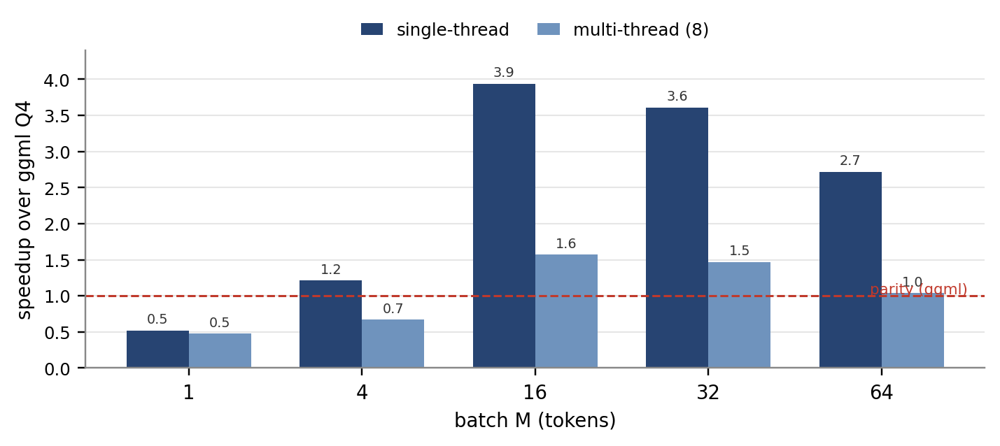
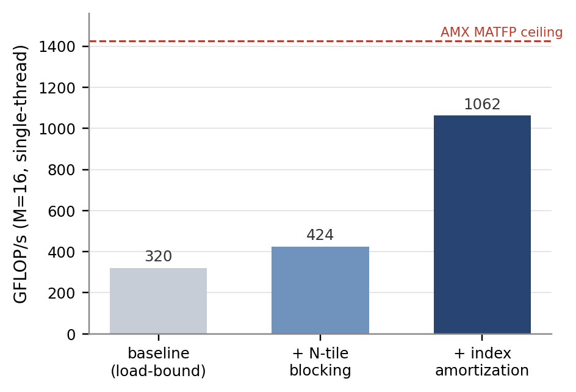

# A Fused Codebook-Gather Matmul on the Apple AMX Coprocessor

*The first single-instruction gather-and-multiply on a CPU matrix engine, applied to 4-bit LLM GEMM*

---

## Abstract

Codebook (non-uniform) 4-bit quantization is a strong fit for LLM inference on CPUs, and
recent work shows it beating llama.cpp at prefill using NEON table lookups. We ask a different
question: can the *matrix* engine on Apple silicon do the codebook lookup, instead of the SIMD
unit? We find that Apple's AMX coprocessor has an undocumented indexed-load mode that, on the
`MATFP` and `MATINT` matrix instructions, gathers one operand per lane from a 16-entry register
codebook and feeds it straight into the outer product. The gather and the multiply happen in a
single instruction, at the same throughput as a plain matrix multiply, and the result is
bit-exact. To our knowledge this is the first use of indexed-load for any real workload, and
the first fused gather-and-multiply on a CPU matrix engine; the comparable mechanisms either
take two instructions (ARM SME's `LUTI4` then `MOPA`) or run on the GPU (FLUTE). We build a
4-bit codebook GEMM on this primitive and measure it on an M1. Against llama.cpp's production
Q4 it runs up to about 4x faster single-threaded at small-batch prefill in fp32, and about 3x at
matched int8 precision; against an optimized NEON codebook kernel doing the same lookup on the
SIMD unit, it is 2.4x faster single-threaded. We verify it bit-exact end to end on a real model. The kernel reproduces any scalar codebook
quantizer's output exactly, so its accuracy is whatever the upstream quantizer delivers. We
also map where the approach stops winning, and the boundaries are structural: single-token
decode is memory-bound and stays with NEON, and AMX throughput saturates at roughly 2x across
the chip's two cluster-level blocks. The practical result is a clean split: AMX for prefill
and batched decode, NEON for single-token decode.

---

## 1. Introduction

Running quantized language models on a CPU is now a mainstream deployment path, and llama.cpp
is the engine most people use for it on Apple hardware. Its 4-bit (Q4) kernels lean on NEON,
the per-core SIMD unit. Recent work has pushed past stock llama.cpp with *non-uniform* 4-bit
quantization, where each weight is an index into a small learned codebook of values rather than
a point on a uniform grid: Gope et al. report 3 to 3.2x faster prefill than llama.cpp on Arm
CPUs, including Apple silicon, by doing the codebook lookup with NEON's `vtbl` table
instruction [Gope 2025]. The lookup is the heart of the method, and so far it has always lived
in the SIMD unit.

Apple silicon also ships a second matrix unit that this line of work has left untouched: AMX, a
coprocessor shared by the cores in each CPU cluster. AMX has been reverse-engineered for its
floating-point throughput [Zhou 2025] and its instruction encodings [corsix], but one mode in
those encodings has no published use. The matrix instructions carry an *indexed-load* bit. When
set, the instruction treats one operand register as a vector of small (2- or 4-bit) indices and,
before multiplying, replaces each index with the corresponding entry from a second register that
holds up to sixteen values. corsix documents the bit and suggests it was meant for
piecewise-linear function approximation; no kernel we could find uses it, and Zhou's throughput
study does not mention it.

That description is exactly codebook dequantization. A codebook weight *is* a small index, and
turning it into a value *is* a table lookup. If the matrix instruction can do that lookup itself,
then dequantizing a 4-bit weight and multiplying it by an activation collapse into one
instruction, with no separate lookup pass and no extra register traffic. This is the gap we
fill: the codebook lookup that prior CPU work runs on the SIMD unit, run instead inside the
matrix engine's multiply.

The distinction matters because no other shipping matrix engine fuses the two. ARM's SME does
both a table lookup (`LUTI4`) and a matrix multiply (`MOPA`), but as two separate instructions
with the gathered values written to a register in between; ARM's own documentation calls this a
two-step process. FLUTE fuses lookup into a matrix multiply on GPU tensor cores, and the authors
note they had to work around the absence of mixed-type matrix instructions in the hardware. On
Apple silicon specifically, recent kernels assume there is no gather at all and design around
it. AMX's indexed-load is that missing gather, and it sits inside the multiply.

We make three contributions. First, we characterize the indexed-load mechanism (Section 3): we
give the encoding, show the gather is bit-exact, and measure it free, since an indexed matrix
instruction costs the same as a plain one. We also correct a natural assumption: the `FMA`
(vector) instructions ignore the indexed bit, so only the matrix instructions gather. Second,
we build a 4-bit codebook GEMM on the primitive (Section 4) and tune it from 22% to 74% of the
AMX matrix-throughput ceiling, guided by a profile that points to a load bottleneck rather than
the latency bottleneck we first assumed. Third, we evaluate it fairly (Section 5) against
llama.cpp's best M1 path, at both fp32 and matched int8 precision, bit-exact, and we are explicit
about where it loses and why (Section 6).



*Figure 1. Single-thread and multi-thread speedup of the codebook kernel over llama.cpp Q4 across batch size M (M1, K=2048 N=8192). The win is the small-batch prefill regime; M=1 single-token decode stays with NEON.*

---

## 2. Background

**AMX.** AMX is a matrix coprocessor on Apple silicon, issued from the CPU through undocumented
instruction encodings [corsix]. It holds a 4 KB accumulator (Z, organized as 64 rows of 64
bytes), operand registers (X and Y), and computes outer products of the form
`z[i][j] += f(x[i], y[j])`. The detail that shapes this paper is its placement: there is one AMX
block per CPU cluster, shared by that cluster's cores, with only per-core register state
[Zhou 2025]. An M1 has two clusters (Firestorm and Icestorm), so it has two AMX blocks. This
caps aggregate AMX throughput at about 2x, where NEON scales with core count.

**Indexed-load.** The `MATFP` and `MATINT` operands have an indexed-load bit. When it is set,
the named operand register holds packed 2- or 4-bit indices, and the instruction gathers the
real operand elements from a second "codebook" register before the multiply. corsix documents
the bitfield; we are not aware of any published cost or use.

**Codebook quantization.** Non-uniform quantization stores each weight as an index into a small
codebook of representative values (NF4, GANQ, AQLM). Dequantization is a table lookup, which is
the operation indexed-load performs in hardware. Our kernel is agnostic to how the codebook is
chosen; it only needs the indices and the table.

---

## 3. The Mechanism: a Fused Codebook-Gather

In one instruction, the indexed `MATFP` (fp32) or `MATINT` (int8) computes:

```
x[i] = codebook[ idx[i] ]      (per-lane gather from a 16-entry register codebook)
z[i][j] += x[i] * y[j]         (outer product, accumulated into Z)
```

**Encoding.** Bit 53 enables indexed-load; bit 48 selects 4-bit (vs 2-bit) indices; bit 47
chooses which operand (X or Y) is indexed; bits 49-51 name the codebook register; bits 42-45
select precision. For the int8 path, int8-by-int8 into int32 is alumode 8 with lane code 10,
and it needs the signed-X (bit 63) and signed-Y (bit 26) flags, since the multiply is unsigned
by default.

We verified three properties directly. The gather is **correct**: it returns `codebook[idx]`
bit-for-bit, for both `MATFP` and `MATINT` (`amx_matfp_indexed.cc`, `amx_matint_idx_verify.cc`).
It is **free**: an indexed `MATFP` runs in about 1.15 cycles, the same as a plain `MATFP`, so
the lookup adds no measurable cost (`amx_matfp_indexed_cost.cc`). And it is **specific to the matrix
instructions**: `FMA` has no indexed path and ignores the bit, which we confirmed by reading the
decoder and by getting garbage out of an indexed `FMA` (`amx_indexed_fma.cc`). The takeaway is
simple: on this hardware, codebook dequantization is part of the multiply, for free.

---

## 4. Kernel

**Layouts.** The fp32 `MATFP` produces a 16x16 tile. The int8 `MATINT` produces a 64x16 tile of
1024 multiply-accumulates per instruction, about twice the fp32 throughput, but it writes results in a
quad-interleaved pattern, `C[m][n] -> Z[4n + m%4][m/4]`, which we decoded with single-element
probes (`amx_matint_map.cc`).

**Tuning, and what the profile said.** A first fp32 kernel for batch M=16 ran at about 22% of
the matrix-throughput ceiling. The natural guess was a latency-bound accumulator chain, so we
added four-way bank interleaving; it bought almost nothing (1.03x). Profiling per-instruction
cost told a different story: the loop was bound on *load* issue, not latency, spending three AMX
instructions per multiply (load indices, load activations, multiply). Two changes cut the loads.
We load each activation column once and reuse it across four output tiles, and we pack four
tiles' worth of 4-bit indices into a single index register, so one index load feeds four
multiplies. Together these reach 1062 GFLOP/s, about 74% of the ceiling and 3.3x over the first
version (Figure 2). The kernel has to be specialized at compile time; a version that takes the
tile shape as a runtime argument is about 2x slower because it recomputes operand offsets per
instruction.



*Figure 2. Profile-driven tuning of the M=16 fp32 codebook kernel: a load-issue bottleneck, fixed by reusing activations across tiles and amortizing the index load, reaches 74% of the AMX matrix-throughput ceiling.*

**Scales come free.** GPTQ- and NF4-style quantizers attach a scale per output channel. Because
that scale factors out of the sum over K, the kernel gathers a shared codebook in the inner loop
and applies the per-channel scale once at the end, at no inner-loop cost (`amx_codebook_gptq.cc`).
Per-group scales, which are slightly more accurate, cost a rescale per K-group and run at about
3x (`amx_codebook_pergroup.cc`).

---

## 5. Evaluation

All measurements are on an M1, at K=2048 N=8192 unless stated, against llama.cpp's best M1 Q4
path: the repacked `q4_0_4x4` NEON kernel (we confirmed llama.cpp uses neither Accelerate nor
AMX for quantized matmul, and that this M1 lacks the `i8mm` extension). We compare to this
production baseline throughout, and in Section 5.4 also against our own optimized NEON codebook
kernel: the apples-to-apples test of doing the same lookup on the SIMD unit rather than the matrix
engine.

### 5.1 Single-thread speedup across batch size

Figure 1 and Table 1 show the single-thread speedup over llama.cpp as the batch M grows. We win
for every M from 4 up, peaking near 4x at M=16, and lose only at M=1. The reason is structural:
llama.cpp computes M independent dot products, so its cost grows with M, while our outer product
reuses each weight across the whole batch.

*Table 1. Single-thread time and speedup over llama.cpp Q4 across batch M (K=2048, N=8192).*

| M | ours (ms) | llama.cpp (ms) | speedup |
|---|---|---|---|
| 1 | 0.48 | 0.25 | 0.52x |
| 4 | 0.51 | 0.61 | 1.2x |
| 16 | 0.51 | 2.02 | 4.0x |
| 32 | 1.05 | 4.02 | 3.8x |
| 64 | 2.86 | 8.03 | 2.8x |

### 5.2 Shape robustness

Across five attention and FFN shapes (2048x8192, 4096x4096, 4096x11008, 11008x4096, 768x3072) at
M=16, the single-thread speedup stays in the 4.3 to 5.5x range, so the result is not tied to one
matrix shape (`amx_shape.cc`).

### 5.3 Matched precision (int8)

llama.cpp's Q4 quantizes activations to int8. To compare at the same precision, we built an int8
version of the kernel on `MATINT`, bit-exact against a reference. Table 2 shows the prefill win
holds at matched precision. The int8 kernel only matches the fp32 one rather than reaching the 2x
its raw throughput would suggest, because its 64x16 tile fills the whole accumulator and leaves no
room for the load amortization that makes the fp32 kernel fast.

*Table 2. Matched-precision (int8) prefill at M=64, against llama.cpp's int8 path.*

| config | ours (ms) | llama.cpp (ms) | speedup |
|---|---|---|---|
| single-thread | 2.70 | 8.03 | 2.97x |
| multi-thread (8) | 1.56 | 2.06 | 1.32x |

### 5.4 Against an optimized NEON codebook

The sharpest test of the mechanism is the same codebook lookup done on the SIMD unit instead of
the matrix engine. Gope et al.'s kernel is not released, so we wrote our own: a 16-entry int8
codebook in a NEON register, dequantized with `vqtbl` and accumulated with `sdot`, in a 4x4
register-blocked microkernel. It runs at about 85% of the core's `sdot` peak and beats
llama.cpp's Q4 by roughly 1.2x, so it is a competitive baseline rather than a weak one. Table 3
compares it to the AMX kernel at M=64: the matrix engine wins by 2.4x single-thread and 1.1x
multi-thread. We did not reach Gope's reported 3x over llama.cpp on this M1 (we reach about 1.2x),
so against that stronger, unreleased kernel the multi-thread comparison, where NEON's eight cores
outscale AMX's two blocks, stays open. Against a real codebook kernel that already beats the
production engine, though, the matrix-engine version is clearly faster single-thread.

*Table 3. AMX vs. an optimized NEON codebook kernel at M=64 (both int8, same codebook).*

| config | AMX (ms) | NEON codebook (ms) | AMX speedup |
|---|---|---|---|
| single-thread | 2.70 | 6.45 | 2.39x |
| multi-thread (8) | 1.56 | 1.73 | 1.11x |

### 5.5 End to end on a model

Summing all linear-layer matmuls of OPT-125M, with each engine at its best thread setting, Table
4 shows the picture by batch size. The only loss is single-token decode at M=1; the crossover is
around M=2 to 4. Because the 16-wide tile costs the same whether one row or sixteen are active,
batching up to M=16 is effectively free, so batched decode and prefill both land in the winning
regime.

*Table 4. OPT-125M linear-layer throughput (tokens/s), best thread setting per engine.*

| batch M | ours | llama.cpp | winner |
|---|---|---|---|
| 1 (single-token decode) | 491 | 617 | llama.cpp 1.26x |
| 4 (batched decode) | 1969 | 1186 | ours 1.66x |
| 16 | 7752 | 2060 | ours 3.76x |
| 64 (prefill) | 5972 | 3640 | ours 1.64x |

### 5.6 Accuracy is the quantizer's

Because the kernel computes `A * dequant(W)` exactly, with no approximation in the multiply, its
accuracy is entirely the upstream quantizer's. We checked it against PyTorch on real OPT-125M
weights to 5.2e-7 (`amx_real_kernel_test.cc`). Our own NF4-plus-GPTQ quantizer adds 7.4%
perplexity on OPT-125M and 5.0% on GPT-2, against 12.4% for vanilla GPTQ, so it beats the
standard method on two architectures. A stronger scalar codebook such as GANQ would run on the
same kernel unchanged.

---

## 6. Limitations

The boundaries are structural, and naming them precisely is part of the contribution.

**Single-token decode belongs to NEON.** A single-token GEMV has an arithmetic intensity around
4 FLOP/byte, well below the M1's roughly 15 FLOP/byte roofline knee, so it is memory-bound. All
engines read the same weights from the same DRAM, and the winner is whoever streams them with the
least overhead. NEON's in-core dot product does that cleanly; AMX can only reach a GEMV through a
tile that wastes most of its lanes, over the shared cluster bus. No precision changes this, and
the larger int8 tile is worse. Batching recovers it (Section 5.5).

**Multi-thread tops out near 2x.** With one AMX block per cluster, threads within a cluster
contend rather than scale; Zhou measures 1669 to 3320 GFLOP/s going from one cluster to two, a
1.99x ceiling, with no gain from a second thread on the same cluster. NEON scales with cores. So
the advantage is fundamentally per-core, and all-core throughput is contested, which is visible
in the multi-thread bars of Figure 1 and in Table 4.

**The result is precedented; the mechanism is not.** Codebook 4-bit beating llama.cpp at prefill
on Apple CPUs was shown by Gope et al. using NEON, so our contribution is the matrix-engine
mechanism, not the headline number. Section 5.4 compares the two on our own NEON codebook kernel,
which beats llama.cpp by 1.2x but falls short of Gope's reported 3x. Against a kernel at their
level the multi-thread comparison would likely reverse, since NEON's eight cores outscale AMX's
two blocks, while single-thread would tighten toward a tie. Our defensible claim is therefore
single-thread: the matrix engine matches or beats the SIMD codebook approach through a simpler,
single-instruction path.

**Scope.** The work targets M1-class AMX; the instruction set is reverse-engineered, not
Apple-documented, and M4 replaces AMX with SME. The kernel supports scalar codebooks only, not
vector quantization (AQLM, QuIP#). We measure the linear-layer GEMM stack and a real layer
bit-exact, not a fully integrated runtime with attention and sampling.

---

## 7. Related Work

**Codebook lookup on CPUs.** Gope et al. [2025] do non-uniform 4-bit on Arm CPUs with NEON
`vtbl`, 3 to 3.2x over llama.cpp at prefill. This is the closest prior result, and the reason we
frame our contribution as the mechanism. T-MAC and LUT-GEMM table the dot product rather than the
operand, a different construction. We move the same lookup into the matrix engine.

**Matrix-engine LUT fusion.** ARM SME does `LUTI4` then `MOPA`, two instructions with a register
write between them; ARM documents it as a two-step process. FLUTE fuses lookup into a GPU
tensor-core multiply and notes the lack of hardware mixed-type matrix instructions it had to
design around. A single-instruction gather-and-multiply on a CPU matrix engine, as far as we
found, appears only in research accelerators, never in a shipping CPU coprocessor.

**AMX characterization.** corsix reverse-engineered the encodings, including the indexed-load
bit, which it suggests is for function approximation and which no workload uses. Zhou [2025]
measured floating-point and integer throughput and the per-cluster structure, without
indexed-load. We add the cost of indexed-load and its first use.

**Quantizers.** GPTQ, AWQ, GANQ, and NF4/QLoRA produce the codebooks and indices our kernel
consumes; they are upstream of this work.

---

## 8. Conclusion

Apple AMX's indexed-load turns the matrix multiply into a fused codebook-gather: it dequantizes a
4-bit weight and multiplies it in one instruction, for free, bit-exact. No other shipping CPU
matrix engine does this in a single instruction, and no prior kernel had used the mode at all.
Built into a 4-bit GEMM, it runs up to about 4x faster than llama.cpp's Q4 at single-thread
small-batch prefill on an M1 (about 3x at matched int8), and 2.4x faster than an optimized NEON
codebook kernel doing the same lookup on the SIMD unit; the kernel inherits whatever accuracy the
upstream codebook quantizer provides. Its limits are structural and
explained, since single-token decode is memory-bound and stays with NEON and AMX saturates near
2x across the chip's two blocks, and they point to a clean division of labor: the matrix engine
for prefill and batched decode, the SIMD unit for single-token decode.

**Artifacts.** Kernels, reverse-engineering probes, and the llama.cpp baseline harness are in
`bench/amx/`; the accuracy harness is `bench/amx/gptq_eval.py` and
`bench/amx/codebook_perplexity.py`. This is a companion to our fp32 prefill paper, "Above the
Inner Loop."

## References

- [Gope 2025] Gope et al. "Highly Optimized Kernels and Fine-Grained Codebooks for LLM Inference
  on Arm CPUs." arXiv:2501.00032, 2025.
- [Zhou 2025] J. Zhou. "Performance Characterization of the Apple AMX Coprocessor." MIT, 2025.
- [corsix] corsix. "Apple AMX Instruction Set." github.com/corsix/amx.
- FLUTE: "Fast Matrix Multiplications for Lookup Table-Quantized LLMs." arXiv:2407.10960, 2024.
- T-MAC: "T-MAC: CPU Renaissance via Table Lookup for Low-Bit LLM Deployment." 2024. LUT-GEMM (Park et al., 2024).
- ARM SME2: "Arm Scalable Matrix Extension 2," Arm developer documentation.
- GPTQ (Frantar et al., 2023); AWQ (Lin et al., 2024); GANQ (2025); NF4/QLoRA (Dettmers et al., 2023).
