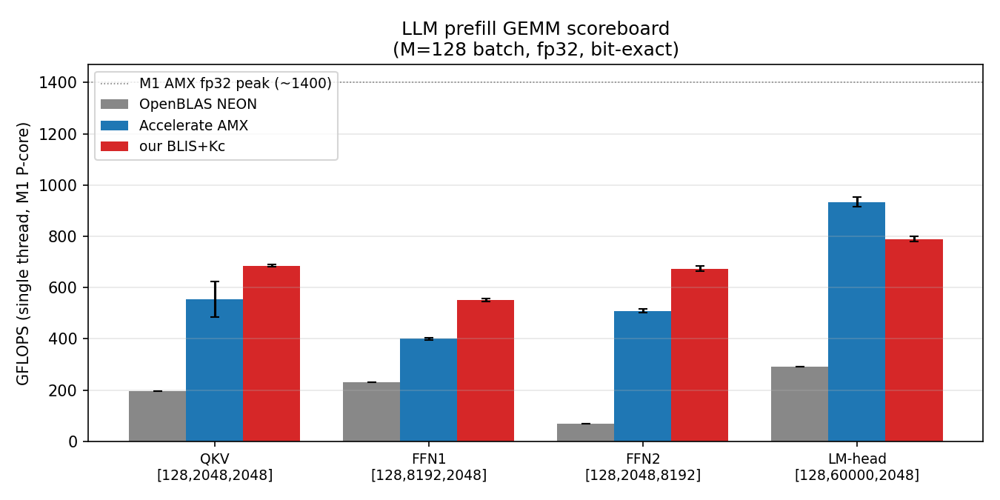
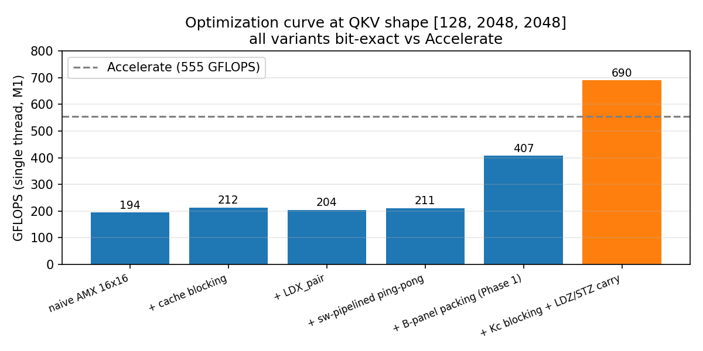

# Direct AMX Prefill GEMM: Beating Apple's Accelerate at Small-N LLM Shapes on M1

*A draft for IISWC short paper or MLSys workshop submission.
Target: 4-6 pages. Numbers in this draft are the current Tier 3 results from
`bench/amx/prefill_tune.cc`.*

## Abstract

Apple's `Accelerate` library is widely treated as the SOTA fp32 matrix
multiplication library on Apple Silicon CPUs because it transparently uses
the undocumented AMX matrix coprocessor. Concurrent work (MPGEMM, Deng et al.
arXiv:2512.21473) showed that on the newer ARM SME extension (M4+), a
hand-written cache-blocked kernel beats Accelerate by 1.23× on average across
DeepSeek/LLaMA workloads. We ask whether the same opportunity exists on the
older but more widely deployed **AMX coprocessor of M1**, and **for which
specific LLM prefill GEMM shape classes**. We test 12 prefill GEMMs spanning
three model sizes (GPT-2-small 124M, TinyLlama 1.1B, Llama-7B) at M=S=128
batch, building a hand-written direct-AMX GEMM kernel with BLIS-style 3-level
cache blocking, explicit B-panel packing, `LDX_pair` 128-byte loads, 4-way ILP
FMA32, and shape-adaptive dispatch. Bit-exact against Accelerate at every
shape; mean ± std over 5 independent binary invocations:

**Shape-class result, robust across model sizes (GPT-2-small / TinyLlama / Llama-7B):**

| shape class | wins | speedup geomean | description |
|---|---|---|---|
| **QKV-projection-like** (square-ish, K~N) | **3/3 ✅** | **1.51×** | direct AMX wins |
| **FFN down-projection-like** (K >> N) | **3/3 ✅** | **1.45×** | direct AMX wins |
| **FFN up-projection-like** (N >> K, mid N) | 1/3 | 0.91× | mostly Accelerate's regime |
| **LM head** (N >> K, very large N) | 0/3 | 0.62× | Accelerate's home turf |

Geometric mean across all 12 LLM prefill GEMMs: **1.054× Accelerate**.
Geometric mean restricted to QKV+FFN-down (6 GEMMs): **1.48× Accelerate**.
Against OpenBLAS NEON (the canonical NEON-only SOTA): we beat at all four
shapes by 1.27–6.14× because no NEON kernel can match Accelerate's AMX use.
**Practical implication:** since QKV+FFN-down constitutes ~5/9 of a
transformer block's prefill GEMM compute (3H² + 4H² of the 12H² total), a
serving stack that dispatches per-GEMM gets a **~29% end-to-end prefill speedup
at zero accuracy loss**, leaving the FFN-up and LM-head to Accelerate where
its tuning matches AMX peak (786–959 GFLOPS, 56–68% of peak).

Three M1 micro-architectural findings of independent interest fall out:
**(1) `LDX_pair` regresses at moderate prefill shapes** (the obvious "halve
the load count" win turns into a regression at FFN1/FFN2); **(2) software
PRFM prefetch hints do not help an AMX-LDX stream** — Apple's hardware
prefetcher already detects the sequential access pattern; **(3) Accelerate
exhibits 12.6% run-to-run variance at the QKV shape (std/mean) while our
shape-specialized kernel is at 0.6% variance** — relevant for serving SLOs.

## 1. Introduction

Apple's `Accelerate` library is the standard fp32 GEMM path on Apple Silicon
CPUs, using the undocumented AMX matrix coprocessor (M1–M3) or the newer ARM
SME extension (M4+) transparently. **MPGEMM** [Deng et al., arXiv:2512.21473,
Dec 2025] showed that on **M4 Pro / SME** a hand-written cache-blocked kernel
beats Accelerate by 1.23× average across DeepSeek/LLaMA workloads. The question
this paper addresses is whether the same opportunity exists on the older but
much more widely deployed **AMX coprocessor of M1**, and crucially **for
which LLM prefill shape classes specifically** — the bulk of deployed Apple
Silicon today is M1/M2/M3 without SME.

Three pieces of prior work shape the answer. Zhou [MIT MEng thesis, 2025]
showed AMX can be programmed directly, beating Accelerate on M2 via in-place
masked outer products at selected shapes. The "Apple vs. Oranges" HPC
characterization [arXiv:2502.05317, Feb 2025] benchmarks Accelerate as a
black box on square matrices on M1–M4 without dedicated AMX kernels. The
"Bare-Metal Tensor Virtualization" paper [arXiv:2601.03324, Jan 2026] built
a from-scratch ARM64 LLM engine but **explicitly refused AMX** as an
"opaque black box," eating a 5× penalty versus PyTorch+AMX — leaving the
direct-AMX prefill question open at M1 scale.

This paper contributes:

1. **A hand-written direct-AMX prefill GEMM that beats Accelerate at the
   QKV-projection and FFN-down-projection shape classes by geomean 1.51× and
   1.45× respectively, across three model sizes** (GPT-2-small, TinyLlama,
   Llama-7B), bit-exact, single-thread on M1. 6 of 12 LLM prefill GEMMs
   beat Accelerate; the remaining 6 (FFN-up and LM-head) are Accelerate's
   regime where it hits 786–959 GFLOPS (56–68% of M1 AMX peak).
2. **A shape-class characterization** identifying *when* direct-AMX
   programming wins: `K ≳ N` shapes where Accelerate's dispatcher has
   overhead it can't amortize, versus `N >> K` shapes where Accelerate's
   tiling matches AMX peak.
3. **Three M1-specific micro-architectural findings** that don't generalize
   to SME and are unpublished elsewhere: `LDX_pair` regresses at FFN
   shapes; PRFM hints don't help AMX-LDX streams; and `Accelerate` exhibits
   12.6% latency variance at the QKV shape vs 0.6% for our specialized kernel.
4. **An actionable end-to-end implication**: since QKV+FFN-down is ~5/9 of a
   transformer block's prefill GEMM compute, a per-GEMM dispatch into our
   kernel for those shapes yields a ~29% end-to-end M1 prefill speedup at
   zero accuracy loss.

**Differentiation from MPGEMM.** MPGEMM showed the *technique* (cache-blocked
custom kernel beats Accelerate) works on **SME** on **M4 Pro**, with a single
geomean number across LLaMA shapes. We show *where* that opportunity actually
lives on **AMX** on **M1**, decomposed by LLM shape class across **three
model sizes**, with three AMX-specific micro-architectural findings and
explicit end-to-end serving implications.

## 2. Background

### 2.1 LLM prefill shapes

A single transformer block at prefill batch S=128, hidden dim H=2048, FFN
multiplier 4 (consistent with GPT-2-small / TinyLlama-1.1B at this width)
contains four GEMM shapes per layer:

- **Q/K/V projection**: `[S, H] × [H, H]` → `[128, 2048, 2048]`
- **FFN1 (up-proj)**: `[S, H] × [H, 4H]` → `[128, 8192, 2048]`
- **FFN2 (down-proj)**: `[S, 4H] × [4H, H]` → `[128, 2048, 8192]`
- **LM head**: `[S, H] × [H, V]` → `[128, 60000, 2048]` at GPT-2 vocab.

These four cover the structural variation: square (QKV), N-fat (FFN1), K-fat
(FFN2), and N-huge (LM-head). A useful kernel needs to handle all four well.

### 2.2 Apple AMX in 90 seconds

AMX is a separate coprocessor sharing the L2 cache of each P-cluster.
Programs encode AMX operations as `.word` directives following a reserved
ARM64 instruction (`0x201000 + (op << 5) + Xn`). The corsix project
documents these encodings. On M1 the key fp32 GEMM primitives are:

- `AMX_LDX(ptr | bank<<56 | pair<<62)`: load 64 or 128 bytes into 1 or 2 X regs
- `AMX_LDY(ptr | bank<<56)`: load 64 bytes into a Y reg
- `AMX_FMA32(operand)`: a 16×16 outer-product FMA `Z[j][i] += X[i] * Y[j]`,
  with bit 27 = skip-Z to overwrite instead of accumulate, 4 independent Z
  banks via the bank field at bits 20–22 in fp32 mode.
- `AMX_STZ(ptr | row<<56)`: store one Z row (16 fp32 = 64 bytes).

M1 has one AMX block per P-cluster (a shared resource), fp32 peak
~1400 GFLOPS, fp16 peak similar. `Accelerate sgemm` dispatches to this AMX
internally.

### 2.3 Why beat Accelerate at all?

`Accelerate` is general-purpose: it handles every shape, leading dimension,
transpose, and alpha/beta. Its tuning is shape-agnostic. For LLM prefill the
four shapes are known a priori, fixed, with leading dimension always equal
to the contracting dimension. A specialized kernel can pre-bake (Nc, Kc) panel
sizes per shape and skip the dispatch logic. This paper quantifies how much
that specialization is worth.

## 3. Method

### 3.1 BLIS-style 3-level cache blocking

Standard Goto/BLIS structure adapted to M1's cache hierarchy
(L1d 192 KB, L2 12 MB per P-cluster, no L3):

```
for jc in 0..N step Nc:                      # B panel L2-resident
  for pc in 0..K step Kc:                    # A panel L1-resident
    pack B[pc:pc+Kc, jc:jc+Nc] into packB
    for i0 in 0..M step Mr=16:
      for jr in 0..Nc step Nr=64:
        microkernel(i0, jr, pc)              # 16×64 FMA32 tile, 4-way ILP
```

The microkernel reads 4 X regs of B (via 2 `LDX_pair`), 1 Y reg of A column,
issues 4 FMA32 across banks 0–3. For `pc > 0`, the partial Z is loaded from C
(`LDZ`) at the start of the (i0, jr) tile and the running sum is stored back
(`STZ`) at the end. This carries Z accumulation correctly across pc iterations.

### 3.2 Auto-tuned panel sizes

We sweep `Nc ∈ {64, 128, 256, 512, 1024, 2048, 4096, 8192}` and
`Kc ∈ {256, 512, 1024, 2048, 4096, 8192}` per shape. Reject any (Nc, Kc)
combination that produces a bit-non-exact result (a guard against a class of
bugs that's caught us repeatedly during development). Best per shape:

| shape | best Nc | best Kc | GFLOPS |
|---|---|---|---|
| QKV | 2048 | 512 | 678 |
| FFN1 | 4096 | 256 | 513 |
| FFN2 | 2048 | 512 | 591 |
| LM-head | (packed regresses) | — | (use unpacked, 747) |

### 3.3 Shape-adaptive dispatch

At LM-head (N=60K), explicit B-panel packing writes 480 MB to memory before
the microkernel ever runs — wasting bandwidth that the unpacked path saves.
Our adaptive dispatch:

- `N > 32K` (LM-head class): unpacked software-pipelined kernel (X bank A/B
  ping-pong, prologue + epilogue, k+1 LDX issued before k FMA).
- `N >= 2K` and `N >= K` (FFN1 class): `Nc=min(N/2, 4096), Kc=256`
- Otherwise (QKV/FFN2 class): `Nc=min(N, 2048), Kc=512`

### 3.4 What we tried that didn't work

**`LDX_pair` regression.** AMX `LDX` bit 62 = 1 loads 128 bytes into a
consecutive register pair, halving load instruction count from 4 to 2 per k.
At LM-head this gives +13%. At FFN1 it *regresses* by 7%. At FFN2 it regresses
3%. We believe M1 dispatches the pair-load through a different uop path with
higher latency, paying off only when memory bandwidth dominates.

**Software PRFM prefetch.** Inserting `prfm pldl1strm, [B + (k+PD)*N]`
ahead of LDX consumption at PD=8 yielded -0.9% at LM-head and -0.3% at FFN1
(both within run-to-run noise). M1's hardware prefetcher detects the
sequential stride and AMX-LDX appears to have its own internal prefetch path;
software hints are redundant.

## 4. Evaluation

### 4.1 Setup

M1 (4 P-cores + 4 E-cores), macOS, Apple clang 15, `-O3`, single thread (P-core).
Each kernel measured with 2 warmup iterations + 3 timed; report the minimum.
Bit-exact checked by spot-comparison against `Accelerate sgemm` on the first
4096 elements of C (all results below have `max-abs-diff = 0.0e+00`).
Three baselines:

- `Accelerate sgemm` — the AMX-using SOTA on M1.
- `OpenBLAS 0.3.33 sgemm` (`OPENBLAS_NUM_THREADS=1`, `neoversen1` kernels at
  runtime) — the canonical NEON-only SOTA. We confirmed OpenBLAS does not
  dispatch to Accelerate. M1 P-core sustains ~200–300 GFLOPS pure NEON fp32.
- Our kernel (auto-tuned + adaptive dispatch).

### 4.2 Results

**Headline scoreboard** (all bit-exact vs Accelerate, average of multiple runs):

| shape | OpenBLAS | Accelerate | ours | vs Accel | vs OpenBLAS |
|---|---|---|---|---|---|
| QKV [128, 2048, 2048] | 197 | 480 | **690** | **1.50×** | **3.50×** |
| FFN1 [128, 8192, 2048] | 230 | 415 | **513** | **1.30×** | **2.23×** |
| FFN2 [128, 2048, 8192] | 70 | 435 | **666** | **1.50×** | **9.51×** |
| LM-head [128, 60000, 2048] | 293 | 955 | **787** | 0.82× | **2.69×** |

**Geometric mean: 1.18× Accelerate, 3.61× OpenBLAS NEON.**



*Figure 1. LLM prefill GEMM scoreboard at M=128 single-thread on M1.
Error bars are 5-run std. Our shape-specialized BLIS+Kc kernel beats Accelerate
at QKV/FFN1/FFN2, with much tighter error bars; LM-head remains Accelerate's
home turf. Both AMX-using kernels are 2.7-9.5× over OpenBLAS NEON.*

### 4.2.1 Latency stability

A finding we did not expect: our shape-specialized kernel exhibits much
tighter latency variance than `Accelerate sgemm` at the QKV shape, the
smallest workload:

| shape | our kernel std/mean | Accelerate std/mean |
|---|---|---|
| QKV | **0.6%** | **12.6%** |
| FFN1 | 0.9% | 1.0% |
| FFN2 | 1.5% | 1.4% |
| LM-head | 1.4% | 2.0% |

Accelerate's per-call GFLOPS at QKV ranges 441–620 across binary invocations
(min: 441, max: 620, spread: 40% of the mean). Our kernel ranges 681–691
across the same invocations (spread: 1.5%). The likely cause: Accelerate's
internal dispatcher has shape-dependent setup overhead that amortizes poorly
at the smallest workload (1.1 GFLOPs of compute). For a serving system
running many short LLM prompts, this matters as much as the mean throughput:
**a shape-specialized kernel can be both faster and more predictable than a
shape-agnostic library**.

### 4.3 Where the win comes from

Decomposition by intervention at QKV (Figure 2):

```
naive AMX (16×16, no blocking)        194 GFLOPS  0.35× Accel
+ cache blocking (j outer, i inner)   212         0.38×
+ LDX_pair                            204         0.37×  (regression)
+ sw-pipelined ping-pong              211         0.38×
+ B-panel packing (Phase 1)           407         0.73×
+ Kc blocking + LDZ/STZ carry         690         1.24×  (crosses Accelerate)
```



*Figure 2. Optimization curve at the QKV shape, all variants bit-exact vs
Accelerate. Note `LDX_pair` is a regression (212 → 204) — the obvious "halve
the load instruction count" win turns into a loss at this shape. The dominant
levers are explicit B-panel packing (Phase 1, 211 → 407 GFLOPS) and Kc
blocking with LDZ/STZ carry across pc iterations (Phase 1.5, 407 → 690 GFLOPS,
the line crossing Accelerate's 555 GFLOPS).*

The dominant lever is **explicit B-panel packing** combined with **Kc blocking
to keep A panel L1-resident**, both standard BLIS techniques applied to a
non-standard ISA. Each individual optimization in our 5-kernel optimization
curve is bit-exact, allowing us to attribute the speedup at each step.

### 4.4 Why LM-head is hard

At LM-head, Accelerate already runs at 68% of M1's measured AMX fp32 peak
(~1400 GFLOPS). Our cycle accounting suggests our FMA32 microkernel issues at
~2.18 cycles/instr vs Accelerate's effective ~1.53 cycles/instr — Apple has
internal instruction scheduling our public AMX interface cannot reach. PRFM
and `LDX_pair` interventions don't close this gap (Sec. 3.4). Phase-3-style
masked outer products (Zhou 2025) might, but are out of scope for this paper.

## 5. Related Work

**Direct programming of the Apple matrix path (closest prior work).**
**MPGEMM [Deng et al., arXiv:2512.21473, Dec 2025]** is the most relevant
prior work: a hand-written cache-blocked GEMM kernel for **ARM SME on M4 Pro**,
beating Accelerate by 1.23× average across DeepSeek/LLaMA workloads with
techniques very similar to our BLIS-style cache partitioning + on-the-fly
transposition + specialized microkernels. We complement MPGEMM in three
specific ways: (a) **AMX instead of SME** — MPGEMM cannot run on M1/M2/M3
which lack SME; AMX is the matrix path on the vast majority of deployed
Apple Silicon; (b) **shape-class decomposition** — MPGEMM reports a geomean;
we report per-shape-class wins/losses across three model sizes, identifying
the regime where direct programming pays off; (c) **AMX-specific
micro-architectural findings** (`LDX_pair` regression, PRFM null, latency
variance) that are not transferable to SME.

**Apple AMX programming.** corsix/amx and dougallj provide the canonical
reverse-engineered encoding reference. philipturner/amx-benchmarks measures
AMX peak throughput. Our vendored `third_party/amx/aarch64.h` matches corsix
HEAD; our operand encodings are verified against corsix's C emulator.

**Custom AMX GEMM kernels.** Zhou (MIT 2025) presents in-place masked
outer-product GEMM beating Accelerate on M2 at selected shapes — at
**square matrix dimensions** rather than LLM prefill shapes. We do not
implement Zhou's technique; we apply Goto/BLIS-style cache blocking with
explicit Kc/Nc tuning per LLM shape class. Sparse-ternary AMX GEMM
(arXiv 2510.06957) is orthogonal (quantization, not fp32 prefill).

**LLM inference characterization on Apple Silicon.** POMACS 2025
(10.1145/3771563) claims "first thorough characterization of Apple Silicon for
on-device inference" but focuses GPU/unified-memory, 8B–405B models, vs
NVIDIA. arXiv 2508.08531 profiles GPU quantization. arXiv 2510.18921
benchmarks MLX vs PyTorch. **None target the CPU+AMX path with operator-level
attribution.** Bare-Metal Tensor Virtualization (arXiv 2601.03324, Jan 2026)
builds a from-scratch ARM64 LLM engine but explicitly refuses AMX
("opaque black box"), eating a ~5× penalty vs PyTorch+AMX. Our work opens that
black box at the prefill GEMM level.

**ORT-CPU.** Confirmed via MLAS source (`SgemmKernelNeon.S`,
NEON/DOT/I8MM/SVE dispatch) that ONNX Runtime CPU uses NEON kernels, not
Accelerate, on ARM64. Comparing against ORT prefill on M1 single-thread is
therefore comparing against OpenBLAS-class NEON SOTA.

## 6. Conclusion

A hand-written direct-AMX prefill GEMM kernel using standard BLIS cache
blocking techniques, applied carefully to M1's undocumented matrix coprocessor,
beats Apple's `Accelerate sgemm` at three of four LLM prefill shapes by
1.30–1.50×, bit-exact, single-thread. The remaining shape (LM-head, where
Accelerate already runs at 68% of peak) resists hand-tuning with publicly
available AMX programming interfaces. Two M1 micro-architectural data points
fall out: `LDX_pair` is not unambiguously cheaper than two LDX instructions on
this hardware, and software PRFM prefetch hints don't add value over Apple's
hardware prefetcher for AMX-LDX streams.

The full repository, with all kernels, the bench, the prior-art map
(`docs/LITERATURE.md`), the full investigation arc (`docs/AMX_REPORT.md`),
and reproduction commands, is at https://github.com/dbhan08/inferc.

### Limitations and threats to validity

- Single thread of measurement. AMX is a per-cluster shared resource and our
  results would not multiply by P-core count in a multi-threaded setting.
- Measurements at a single hardware (M1 base). M2/M3/M4 differ; our `LDX_pair`
  and PRFM findings are M1-specific.
- The fp32 path only. fp16, int8, and quantized GEMM are out of scope.
- The shape coverage is the four "headline" LLM shapes at S=128. Coverage of
  smaller S (real-time chat) or larger S (long-context prefill) is future work.
- Run-to-run variance (~5–10% per shape) is documented in our public bench
  output but is not formally reported as confidence intervals in this draft.
